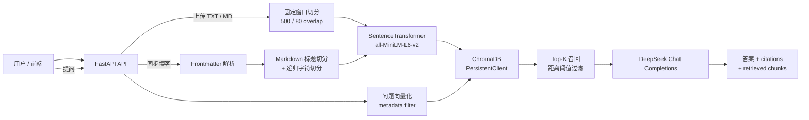

# Mini AI RAG Backend

一个基于 **FastAPI + DeepSeek + SentenceTransformers + ChromaDB** 的轻量级 RAG（Retrieval-Augmented Generation，检索增强生成）后端。

项目支持两类知识来源：

- **文档知识库**：上传 `.txt` / `.md` 文件，完成向量检索与基于文档的问答。
- **Astro 博客知识库**：读取本地 Astro 博客 Markdown/MDX，解析文章结构后同步到向量库并进行问答。

> 这是一个用于验证完整 RAG 链路的 MVP：已实现数据接入、切分、向量化、检索、LLM 回答和引用返回；生产化能力（鉴权、限流、异步任务、评测、部署等）仍待完善。

## 功能特性

- 使用 FastAPI 提供 REST API 与自动生成的 Swagger 文档。
- 使用 `sentence-transformers/all-MiniLM-L6-v2` 在本地生成文本 embedding。
- 使用 ChromaDB 持久化向量、原文与元数据；服务重启后向量数据仍会保留。
- 支持按 `doc_id`、`source_type` 等元数据过滤检索范围。
- 文档问答仅依据召回上下文回答，并返回来源引用和召回片段。
- 博客按 Markdown 标题层级切分；标题、章节与标签会参与 embedding，提升结构化内容的召回效果。
- 博客同步使用稳定 chunk ID；新向量写入成功后再清理过期 chunk，降低同步失败时丢失旧数据的风险。
- 当博客知识库没有足够相关内容时，接口会明确标记回答来自通用模型知识，而非博客内容。

## 架构与数据流



## 实现效果


## 技术栈

| 类别 | 技术 |
| --- | --- |
| API 服务 | FastAPI、Uvicorn、Pydantic |
| 大语言模型 | DeepSeek（通过 OpenAI SDK 调用兼容接口） |
| Embedding | `sentence-transformers/all-MiniLM-L6-v2` |
| 向量数据库 | ChromaDB（本地持久化） |
| 文档处理 | `python-frontmatter`、`langchain-text-splitters` |
| 配置管理 | `python-dotenv` |

## 环境要求

- Python 3.10+
- 可访问 DeepSeek API 的网络环境
- 首次启动时会下载 embedding 模型，并创建 `uploads/` 与 `chroma_db/` 目录
- 如需启用博客同步功能，需要准备本地 Astro 博客内容目录（详见 [博客同步配置](#博客同步配置)）

## 快速开始

### 1. 创建虚拟环境并安装依赖

```bash
python -m venv .venv
```

**Windows PowerShell：**

```powershell
.\.venv\Scripts\Activate.ps1
pip install -r requirements.txt
# 当前版本的 requirements.txt 尚未锁定以下两个直接依赖，首次安装请补充：
pip install langchain-text-splitters python-frontmatter
```

**macOS / Linux：**

```bash
source .venv/bin/activate
pip install -r requirements.txt
# 当前版本的 requirements.txt 尚未锁定以下两个直接依赖，首次安装请补充：
pip install langchain-text-splitters python-frontmatter
```

### 2. 配置环境变量

在项目根目录创建 `.env` 文件：

```env
# 必填：DeepSeek API Key
DEEPSEEK_API_KEY=your_api_key

# 可选：默认使用 deepseek-chat
DEEPSEEK_MODEL=deepseek-chat

# 可选：博客站点地址，仅用于生成文章 URL
BLOG_BASE_URL=http://localhost:4321
BLOG_URL_PREFIX=/blog
```

说明：

- `DEEPSEEK_API_KEY` 是 `/chat`、`/ask-document-vector` 和 `/ask-blog` 的必填配置。
- `DEEPSEEK_MODEL` 未设置时默认使用 `deepseek-chat`。
- `BLOG_BASE_URL` 与 `BLOG_URL_PREFIX` 只用于拼接博客文章 URL，不决定本地博客文件从哪里读取。
- 不要提交 `.env`、API Key、`uploads/` 或 `chroma_db/` 到远程仓库。

### 3. 启动服务

```bash
uvicorn main:app --reload
```

服务启动后可访问：

- API 根路径：`http://127.0.0.1:8000`
- Swagger 文档：`http://127.0.0.1:8000/docs`
- 健康检查：`http://127.0.0.1:8000/health`

## API 概览

| 方法 | 路径 | 说明 |
| --- | --- | --- |
| `GET` | `/` | 返回服务状态和接口列表 |
| `GET` | `/health` | 返回向量数量、模型信息与内存中文档数 |
| `POST` | `/chat` | 直接调用 DeepSeek 进行普通对话 |
| `POST` | `/upload-document` | 上传 UTF-8 编码的 `.txt` 或 `.md` 文档并向量化 |
| `POST` | `/vector-search-document` | 在已上传文档中执行语义检索 |
| `POST` | `/ask-document-vector` | 根据已上传文档回答问题并返回引用 |
| `POST` | `/sync-blog` | 读取并同步本地 Astro 博客文章 |
| `POST` | `/ask-blog` | 根据已同步博客内容回答问题 |

### 健康检查

```http
GET /health
```

示例响应：

```json
{
  "status": "ok",
  "service": "mini-rag-assistant",
  "memory_document_count": 1,
  "vector_count": 8,
  "embedding_model": "sentence-transformers/all-MiniLM-L6-v2",
  "deepseek_model": "deepseek-chat"
}
```

### 普通对话

```http
POST /chat
Content-Type: application/json
```

```json
{
  "message": "请用一句话介绍 RAG。"
}
```

### 上传文档

```http
POST /upload-document
Content-Type: multipart/form-data
```

表单字段名为 `file`，当前仅支持 UTF-8 编码的 `.txt` 与 `.md` 文件。

示例响应：

```json
{
  "doc_id": "xxxxxxxx-xxxx-xxxx-xxxx-xxxxxxxxxxxx",
  "filename": "notes.md",
  "char_count": 1234,
  "chunk_count": 6,
  "chunks_preview": ["...", "..."]
}
```

### 文档向量检索

```http
POST /vector-search-document
Content-Type: application/json
```

```json
{
  "query": "项目使用了什么向量数据库？",
  "doc_id": null,
  "top_k": 3
}
```

- `doc_id` 为 `null` 时，在所有上传文档中检索。
- `top_k` 取值范围为 1–10。
- 接口会过滤距离过大的候选；距离阈值需结合 embedding 模型和评测数据进一步调优。

### 基于文档的问答

```http
POST /ask-document-vector
Content-Type: application/json
```

```json
{
  "question": "文档中如何描述 FastAPI？",
  "doc_id": null,
  "top_k": 3
}
```

响应包含 `answer`、`citations` 与 `retrieved_chunks`。没有检索到足够相关内容时，服务会返回：

```json
{
  "answer": "I don't know based on the uploaded documents.",
  "citations": [],
  "retrieved_chunks": []
}
```

## 博客同步配置

当前 `services/blog_load.py` 会从下列**本地固定路径**读取博客文件：

```text
<mini-ai-backend 的父目录>/fumbling-field/src/content/blog
```

例如，若后端目录为：

```text
G:/FOR STUDY/AI Agent/mini-ai-backend
```

则 Astro 博客内容目录应位于：

```text
G:/FOR STUDY/AI Agent/fumbling-field/src/content/blog
```

支持递归读取 `.md` 与 `.mdx` 文件。每篇文章会经历以下流程：

1. 使用 Frontmatter 解析 `slug`、`title`、`tags`、日期和正文。
2. 先按 H1/H2/H3 标题分段，再对过长段落递归切块。
3. 为 embedding 组合文章标题、章节、标签和正文；向量库中保存原始正文片段。
4. 生成稳定 chunk ID，写入新向量后清理已过期的旧向量。

同步接口：

```http
POST /sync-blog
```

实际响应会返回处理结果，例如：

```json
{
  "file_count": 5,
  "synced_count": 5,
  "failed_count": 0,
  "synced_posts": [
    {
      "slug": "intro-to-ai",
      "title": "AI 入门",
      "file": ".../intro-to-ai.md",
      "chunk_count": 4
    }
  ],
  "failed_posts": []
}
```

> **注意**：当前博客内容路径尚未环境变量化，单独克隆本仓库后不能直接使用 `/sync-blog`。计划改进是增加 `BLOG_CONTENT_DIR` 配置或通过容器挂载博客内容目录。

### 基于博客的问答

```http
POST /ask-blog
Content-Type: application/json
```

```json
{
  "question": "博客中提到了哪些 AI 技术？",
  "top_k": 4
}
```

- 命中足够相关博客内容时，返回 `answer_mode: "blog"`，并带文章标题、URL、章节等引用。
- 未命中足够相关内容时，返回 `answer_mode: "general"`，并明确标识答案来自通用模型知识，避免伪造博客引用。

## 项目结构

```text
mini-ai-backend/
├── main.py                    # FastAPI 应用、接口定义与通用 RAG 逻辑
├── requirements.txt           # Python 依赖清单
├── README.md                  # 项目说明
├── services/
│   ├── blog_indexer.py        # 博客索引、稳定 ID 与旧 chunk 清理
│   ├── blog_load.py           # 加载本地 Astro 博客文件
│   ├── chunker.py             # Markdown 标题切分与递归文本切分
│   └── markdown_cut.py        # Frontmatter / Markdown 解析
├── image/                     # 项目演示截图
├── Content/                   # 项目上下文文档
├── uploads/                   # 上传文件（运行时生成，不应提交）
└── chroma_db/                 # ChromaDB 持久化数据（运行时生成，不应提交）
```

## 核心设计说明

### 为什么生成模型与 embedding 模型分离？

DeepSeek 负责生成可读的最终答案；SentenceTransformer 负责将文档和查询映射到同一向量空间。这样可以让检索与生成各自选择合适的模型，便于控制延迟与成本。

### 为什么要使用 chunk overlap？

文本可能在切分边界处被截断。重叠窗口能让边界附近的信息同时出现在相邻 chunk 中，降低关键信息丢失的概率；代价是向量数量、存储和上下文长度增加。

### 为什么还需要距离阈值？

Top-K 检索只保证返回“相对最接近”的若干片段，并不代表它们一定相关。距离阈值用于过滤明显不相关的候选。该参数与 embedding 模型、向量索引的距离度量和业务语料相关，应通过标注问题集进行评测和调优。

### 如何减少幻觉？

文档问答 Prompt 要求模型只依据检索到的上下文作答；无相关上下文时返回不知道；同时返回 citations 与召回片段供前端展示和人工复核。Prompt 约束不能替代安全机制，生产环境仍应增加回答校验与 prompt injection 防护。

## 当前限制与下一步

- [ ] 将 `BLOG_DIRECTORY` 改为环境变量 `BLOG_CONTENT_DIR`，使服务可以独立部署。
- [ ] 补齐并锁定 `langchain-text-splitters`、`python-frontmatter` 等直接依赖。
- [ ] 增加文件大小限制、内容类型校验、鉴权、限流与审计日志。
- [ ] 将长耗时的 embedding / 博客同步迁移到后台任务队列。
- [ ] 增加单元测试、集成测试以及基于问题集的检索与回答质量评测。
- [ ] 为生产环境配置 CORS 白名单、密钥管理、可观测性和部署方案。

## 适用场景

- RAG 学习与作品集项目
- 个人文档知识库问答
- Astro 技术博客的内容检索与问答

## License

暂未声明许可证。
